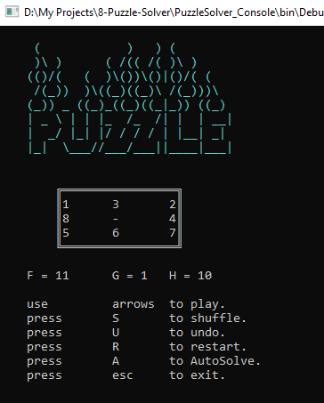
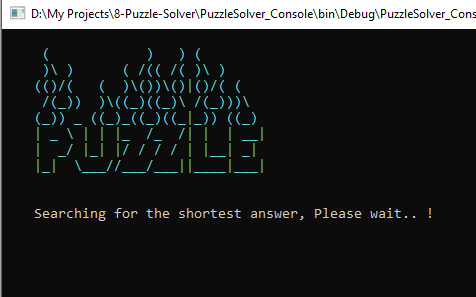
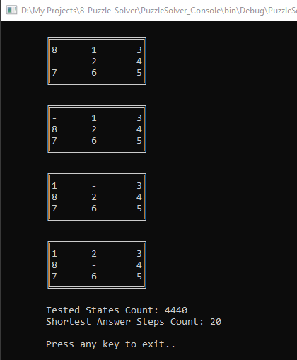
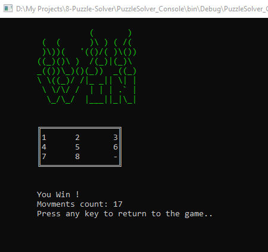
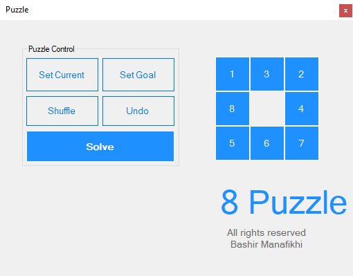
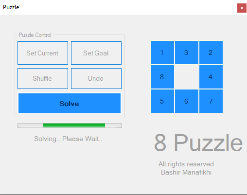
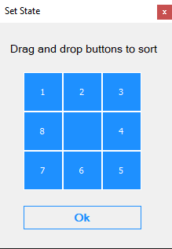

# 8-Puzzle-Solver
This application can solve 8 puzzle game in a shortest way..  Using A*  (A Star) algorithm .

Using C# language, This project offers a solution for the classic 8 puzzle game using the A* (A Star) algorithm. Notably, the implementation does not rely on any third-party AI libraries. Every aspect, including matrix calculations and algorithmic calculations, is manually written for optimal performance and understanding.

This project was developed in early **2021**

## Project Structure

The project consists of three main components:

1. **Library Framework**: Contains all necessary models and calculations for implementing the logic of the 8 puzzle game. Developers can easily integrate this library into their own projects to leverage the functionality provided.

2. **Console Application**: Implements and utilizes the functionality provided by the Library Framework. It provides a user-friendly console interface for playing and solving the 8 puzzle game. The console application supports intuitive controls, including:
   - Arrow keys: Control the game
   - 's' key: Shuffle the puzzle state
   - 'U' key: Undo the last steps
   - 'R' key: Restart the game
   - 'A' key: Auto solve the game
   - 'ESC' key: Exit the game

   Additionally, the algorithm automatically solves the game and prints:
   - Tested states count
   - Shortest answer steps count
   - All steps of the shortest answer

   The console application also keeps track of user moves, allowing for easy undoing of steps.
   
### Console Application Screenshots

| Main Page | Searching Shortest Answer | Auto Solve Result | Win Page |
| --- | --- | --- | --- |
|  |  |  |  |

3. **Windows Forms Application**: Implements and utilizes the functionality provided by the Library Framework. Provides a graphical user interface (GUI) for playing and solving the 8 puzzle game. Key features include:
   - Intuitive UI elements for shuffling, undoing, and auto-solving the puzzle
   - Ability to set the current state manually by dragging numbers
   - Setting the goal state of the puzzle via drag-and-drop
   - Live motion display during puzzle-solving, showing all steps of the shortest answer

### Windows Forms Application Screenshots

| Main Page | Searching Shortest Answer | Set Current Or Goal State |
| --- | --- | --- |
|  |  |  |

## A* (A Star) Algorithm

The A* algorithm is a heuristic search algorithm widely used in pathfinding and graph traversal. In the context of the 8 puzzle game, A* efficiently searches through the possible states of the puzzle, prioritizing states based on an evaluation function that combines the cost of reaching a state with an estimate of the cost from that state to the goal state.

The strength of the A* algorithm lies in its ability to guarantee an optimal solution while minimizing computational overhead. By intelligently exploring the state space of the puzzle and making informed decisions based on heuristic estimates, A* can efficiently find the shortest path to solve the puzzle.

